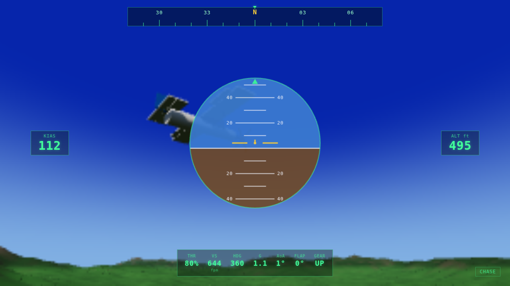

# 🛩️ SkyForge

A real-time 3D flight simulator that runs in the browser on your Mac — built on
genuine physics-based aerodynamics, a procedurally generated world, and a
full glass-cockpit HUD. No install, no launcher: `npm run dev` and you're flying.

> **On the "better than MSFS 2024 + X-Plane 12" goal — straight talk.**
> Those two simulators represent hundreds of engineer-years and proprietary
> global terrain/satellite datasets; no single project beats them outright.
> What SkyForge *is*: a real, honest flight model (it stalls, trims,
> weathercocks, and even exhibits a phugoid), an infinite-feeling procedural
> world, and a clean, hackable codebase you fully own and can grow. It's a
> foundation built to extend — not a tech demo.



---

## Features

- **Physics-based flight model** — 6-DOF rigid-body integration with
  airspeed-dependent lift/drag, an angle-of-attack lift curve with a soft
  **stall**, induced + parasitic drag, static pitch/yaw stability,
  aerodynamic rate damping, propeller thrust that lapses with speed, and air
  density that thins with altitude. The aircraft genuinely **trims** and
  **porpoises (phugoid)** like the real thing.
- **Procedural world** — seeded Perlin/fbm terrain (24 km²) rising from a
  flat airfield to distant snow-capped ridges, with elevation/slope-based
  colouring, forests, a marked runway (36/18), a hangar and a control tower.
- **Atmosphere** — custom gradient sky shader with a sun glow + disk,
  distance haze, soft sun shadow that tracks the aircraft.
- **Glass-cockpit HUD** — artificial horizon with pitch ladder & bank
  pointer, airspeed/altitude tapes, a sliding heading tape, plus throttle,
  vertical speed, heading, G-load, AoA, flaps and gear readouts, and a stall
  warning.
- **Three camera modes** — chase, cockpit, and an external orbit view.
- **Keyboard + gamepad** — analog stick & trigger-throttle control if a
  controller is connected.

## Run it (macOS)

Requires [Node.js](https://nodejs.org) 18+ (`brew install node`).

```bash
npm install
npm run dev      # open the printed http://localhost:5173 URL
```

Production build / preview:

```bash
npm run build
npm run preview
```

Verify the flight physics from the terminal (no browser needed):

```bash
node test/sim-check.js   # simulates a full-throttle takeoff and climb
```

## Controls

| Input | Action |
| --- | --- |
| `W` / `S` | Throttle up / down |
| `↑` / `↓` | Pitch (nose down / up) |
| `←` / `→` | Roll left / right |
| `A` / `D` | Rudder (yaw) left / right |
| `B` / `Space` | Wheel brakes (hold) |
| `F` / `V` | Flaps extend / retract |
| `G` | Landing gear toggle |
| `C` | Cycle camera |
| `R` | Reset to runway |
| `P` / `Esc` | Pause |

**Quick start:** press `FLY NOW`, hold `W` to spool up to full throttle, let
it accelerate down the runway, and gently hold `↓` (nose-up) at about 55 kt to
rotate and climb away.

Gamepad: right stick = pitch/roll, left stick X = rudder, right trigger =
throttle, left trigger = brakes, A = gear, X = flaps, Y = camera.

## Architecture

```
src/
  core/      math (seeded Perlin/fbm), input (keyboard+gamepad), camera rig
  engine/    WebGL renderer, lighting, fog, shadow tracking
  world/     sky shader, procedural terrain, airfield environment
  aircraft/  flightModel (the aerodynamics), 3D model, glue + animation
  ui/        HUD instruments, menu
  main.js    game state machine + fixed-timestep loop
```

The simulation runs on a **fixed 120 Hz timestep** (decoupled from render rate)
for numerical stability, with rendering interpolated each animation frame.

### The flight model in one paragraph

Each step, world-frame velocity is rotated into the body frame to find true
airspeed, **angle of attack** and **sideslip**. Lift and drag coefficients are
evaluated (`Cl(α)` with a post-stall flat-plate blend; `Cd = Cd0 + Cl²/πeAR`),
scaled by dynamic pressure `½ρV²S`, and applied as forces; thrust acts along the
nose and gravity in world space. Control surfaces and static stability generate
moments about the body axes, opposed by airspeed-scaled rate damping, which are
integrated through a diagonal inertia tensor to update the orientation
quaternion. On the ground, wheel friction, lateral grip, braking and nose-wheel
steering take over until the wings make enough lift to fly. See
[`src/aircraft/flightModel.js`](src/aircraft/flightModel.js).

## Roadmap

- Multiple aircraft (jets, gliders) with per-type aero tables
- Wind, turbulence and weather
- Streamed real-world elevation tiles
- Sound (engine, wind, stall horn) and instrument needles
- Wrap as a native macOS `.app` with [Tauri](https://tauri.app)

## License

MIT — see [LICENSE](LICENSE).
